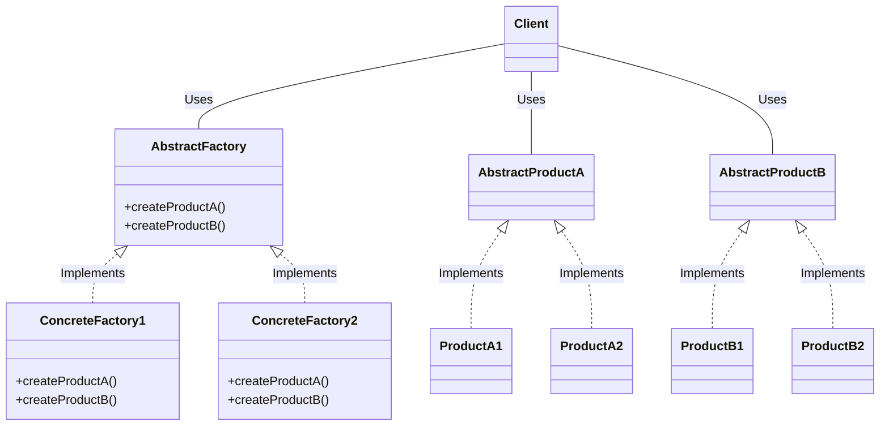

# Abstract Factory

## Examples

**[Template Factory](https://github.com/khalid-el-masnaoui/OOP-Principles-and-Design-Patterns-Notes/blob/main/design-patterns/Creational/AbstractFactory/TemplateFactory.php)**
**[Writer Factory](#https://github.com/khalid-el-masnaoui/OOP-Principles-and-Design-Patterns-Notes/blob/main/design-patterns/Creational/AbstractFactory/WriterFactory.php)**
**[Car Factory](https://github.com/khalid-el-masnaoui/OOP-Principles-and-Design-Patterns-Notes/blob/main/design-patterns/Creational/AbstractFactory/CarFactory.php)**
**[Barrack Factory](#https://github.com/khalid-el-masnaoui/OOP-Principles-and-Design-Patterns-Notes/blob/main/design-patterns/Creational/AbstractFactory/BarrackFactory.php)**

## Definition 

Abstract Factory is used create series of related or dependent objects without specifying their concrete classes. Usually the created classes all implement the same interface. The client of the abstract factory does not care about how these objects are created, it just knows how they go together.

## Diagram 

## When to Use

Use the Abstract Factory design pattern when you need to create families of related objects, ensure they are compatible, and want to decouple your client code from the specific concrete classes being used. It is especially useful when your system needs to be flexible and support different product variations, such as for different operating systems or databases, without changing the core client code. 

When to use Abstract Factory

- **Creating families of related objects:** When you need to create sets of objects that must be used together, like a sports kit with matching shoes and a shirt, or a set of GUI elements that all have the same style (e.g., all macOS-themed). 
    
- **Supporting different product families:**  If you need to swap entire families of products—such as different database implementations (e.g., SQL, NoSQL) or different GUI toolkits (e.g., Windows, macOS)—without changing the client's code. 
    
- **Decoupling client code from concrete classes:**  When you want to hide the object creation process from the client. The client code interacts with the abstract factory and abstract products, but it doesn't know the concrete classes it's actually creating or using. 
    
- **Ensuring consistency and compatibility:**  When you need to enforce that all objects from a single "factory" maintain a consistent style or are otherwise compatible with each other. 
    
- **Adding new product variants easily:**  The pattern makes it easier to extend your system. To add a new family of products, you can create a new concrete factory for that family without modifying the existing client code or other factories.
