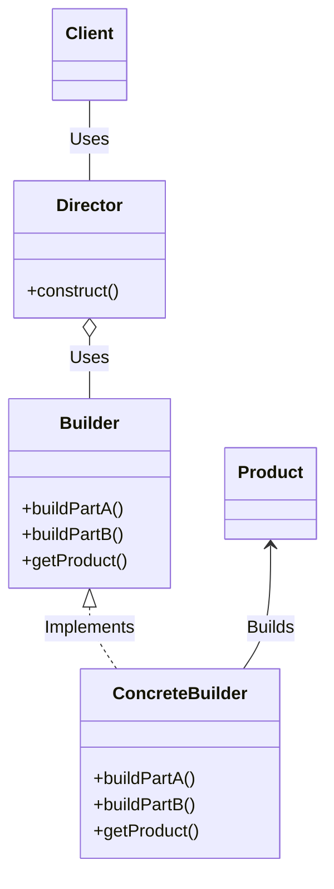

# Builder

## Examples

- **[Car Builder](https://github.com/khalid-el-masnaoui/OOP-Principles-and-Design-Patterns-Notes/blob/main/design-patterns/Creational/Builder/CarBuilder.php)**
- **[Page Builder](https://github.com/khalid-el-masnaoui/OOP-Principles-and-Design-Patterns-Notes/blob/main/design-patterns/Creational/Builder/PageBuilder.php)**
- **[Car Builder - 2](https://github.com/khalid-el-masnaoui/OOP-Principles-and-Design-Patterns-Notes/blob/main/design-patterns/Creational/Builder/CarBuilder-2.php)**
- **[Vehicle Builder](https://github.com/khalid-el-masnaoui/OOP-Principles-and-Design-Patterns-Notes/blob/main/design-patterns/Creational/Builder/VehicleBuilder.php)**

## Definition 

The Builder pattern suggests that you extract the object construction code out of its own class and move it to separate objects called _builders_. It is an interface that build parts of a complex object.

-  The main idea behind Builder pattern is prevent **telescoping constructor**

- To “Separate the construction of a complex object from its representation so that the same construction process can create different representations.”

- It helps in constructing a complex object step by step and the final step will return the object.

- Sometimes, if the builder has a better knowledge of what it builds, this interface could be an abstract class with default methods (aka adapter).

- If you have a complex inheritance tree for objects, it is logical to have a complex inheritance tree for builders too.

The director class (optional) defines the order in which to execute the building steps, while the builder provides the implementation for those steps

- ,The director class might be a good place to put various construction routines so you can reuse them across your program. It also completely hides the details of product construction from the client code. 

**Note:** Builders have often a **fluent interface**, see the mock builder of PHPUnit for example.

## Diagram 

## When to Use

Use the builder design pattern when creating complex objects with many optional or mandatory parameters, as it improves code readability and makes construction more flexible. It is also beneficial when an object's construction involves multiple steps, to handle different configurations of an object, or to create different representations of a product.

Scenarios where the builder pattern is useful

- **Numerous parameters:**  It simplifies constructors with a large number of parameters, especially when many are optional, which improves readability over long or telescoping constructors. 
    
- **Step-by-step construction:**  When the object requires a complex, multi-step creation process, the builder allows you to build it incrementally. 
    
- **Multiple configurations:**  It is useful when you need to create different variations or configurations of the same object, like building a house with different options for the roof and doors. 
    
- **Separating construction from representation:**  The pattern separates the construction logic from the object itself, making the code more maintainable and allowing the client to be independent of how the object is built. 
    
- **Enforcing object validity:**  A builder can ensure an object is in a valid state before it is returned. For example, a `build()` method can check that all mandatory fields have been set, and a builder can handle this logic instead of a complex object with setters that could leave it in an inconsistent state.
