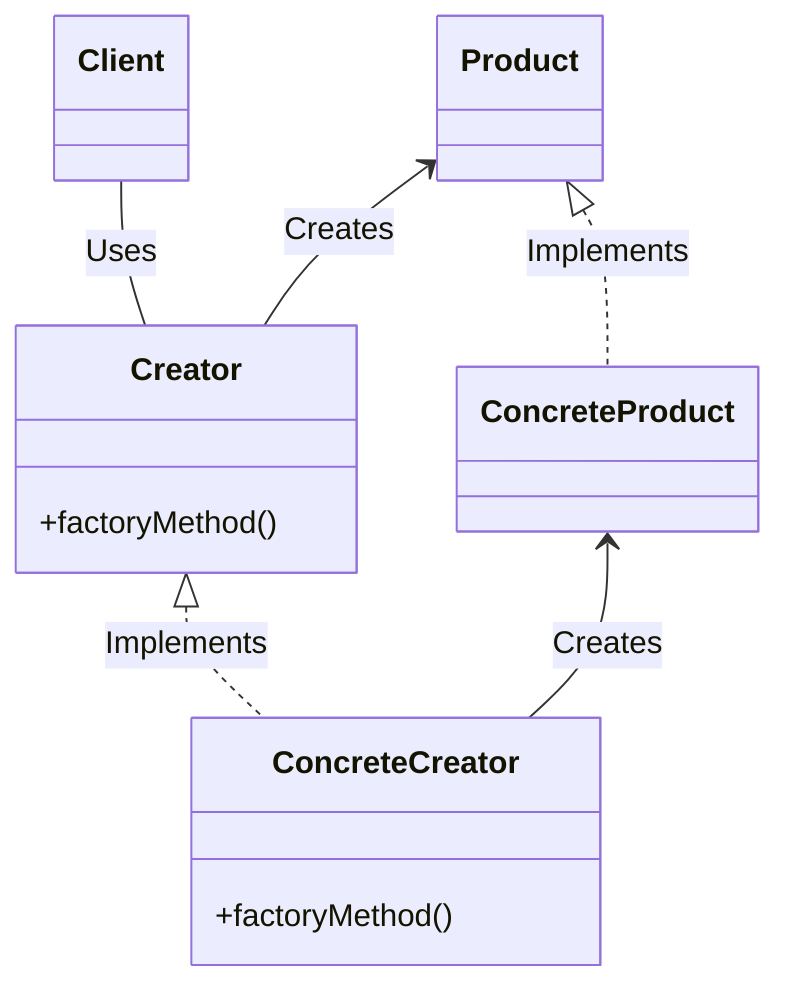

# Factory Method

## Examples

- **[Car Builder](https://github.com/khalid-el-masnaoui/OOP-Principles-and-Design-Patterns-Notes/blob/main/design-patterns/Creational/Builder/CarBuilder.php)**
- **[Page Builder](https://github.com/khalid-el-masnaoui/OOP-Principles-and-Design-Patterns-Notes/blob/main/design-patterns/Creational/Builder/PageBuilder.php)**
- **[Car Builder - 2](https://github.com/khalid-el-masnaoui/OOP-Principles-and-Design-Patterns-Notes/blob/main/design-patterns/Creational/Builder/CarBuilder-2.php)**
- **[Vehicle Builder](https://github.com/khalid-el-masnaoui/OOP-Principles-and-Design-Patterns-Notes/blob/main/design-patterns/Creational/Builder/VehicleBuilder.php)**

## Definition 

**Factory Method** is a creational design pattern that provides an interface for creating objects in a superclass, but allows subclasses to alter the type of objects that will be created.

Instead of directly instantiating objects using constructors, client code interacts with a Creator object. The Creator's factory method is responsible for producing the appropriate Product object. The specific type of Product created is determined by the Concrete Creator subclass that implements the factory method. This allows the client to work with a common interface (the Product interface) without needing to know the concrete class of the object being created.

- At first glance, this change may look pointless: we just moved the constructor call from one part of the program to another. However, consider this: now you can override the factory method in a subclass and change the class of products being created by the method.

- There’s a slight limitation though: subclasses may return different types of products only if these products have a common base class or interface. Also, the factory method in the base class should have its return type declared as this interface.

## Diagram 

## When to Use

Many designs start by using **Factory Method** (less complicated and more customizable via subclasses) and evolve toward **Abstract Factory**.

**Abstract Factory classes** are often based on a set of **Factory Methods**.

Scenarios where you can use **factory method**:

- **When a class cannot anticipate the type of objects it needs to create beforehand:**  If your code needs to work with various types of objects that share a common interface or abstract class, but the specific concrete type is not known until runtime, the Factory Method allows you to defer the instantiation to subclasses. 
    
- **When you want to provide a way for users of your library or framework to extend its internal components:**  By using a Factory Method, you can define a flexible mechanism for creating objects, allowing clients to subclass your factory and introduce their own custom object types without modifying the core library code. 
    
- **When you want to hide the creation logic from the client:**  The Factory Method encapsulates the object creation process within the factory, preventing the client from needing to know the details of how an object is instantiated. This promotes loose coupling and makes the system more maintainable. 
    
- **When object creation involves complex logic or dependencies:**  If the process of creating an object is intricate, requiring multiple steps, resource management, or interaction with other components, a Factory Method can centralize this logic, making it easier to manage and modify.
    
- **When you need to decide the object type at runtime based on certain conditions:**  For instance, if you have a configuration or user input that dictates which specific concrete class should be instantiated, the Factory Method can contain the conditional logic to return the appropriate object.
    
- **When you want to save system resources by reusing existing objects (caching):**  While not its primary purpose, a Factory Method can be implemented to include caching mechanisms, returning existing instances of objects instead of always creating new ones, which can be beneficial for resource-intensive objects.
