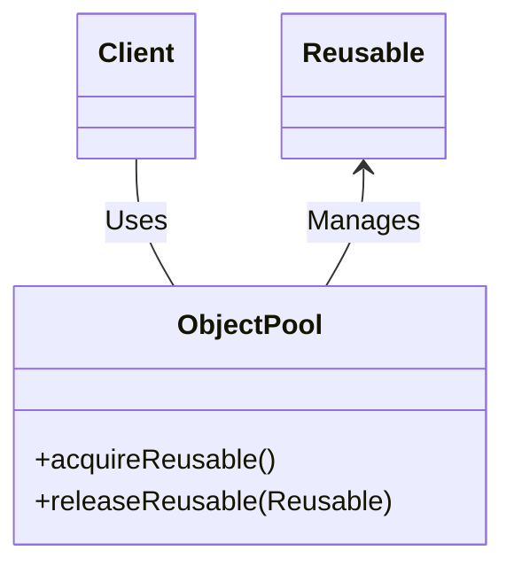

# Object Pool

## Examples

- **[Database Connection Pool](https://github.com/khalid-el-masnaoui/OOP-Principles-and-Design-Patterns-Notes/blob/main/design-patterns/Creational/ObjectPool/DatabaseConnectionPool.php)**
- **[Database Connection Pool - 2](https://github.com/khalid-el-masnaoui/OOP-Principles-and-Design-Patterns-Notes/blob/main/design-patterns/Creational/ObjectPool/DatabaseConnectionPool2.php)**
- **[Worker Pool](https://github.com/khalid-el-masnaoui/OOP-Principles-and-Design-Patterns-Notes/blob/main/design-patterns/Creational/ObjectPool/WorkerPool.php)**

## Definition 

The **Object Pool** design pattern is a creational pattern that manages a pool of reusable objects. Instead of repeatedly creating and destroying expensive objects, the pattern allows clients to "borrow" objects from a pre-initialized pool and return them after use. This approach minimizes the overhead associated with object instantiation and garbage collection, leading to improved performance and resource management, especially in scenarios involving high-frequency object creation or costly resources like database connections, threads, or network sockets.

Key components of the Object Pool pattern:
- **Object Pool:**  This class maintains a collection of reusable objects. It handles the creation of new objects when the pool is initially filled or when the pool needs to expand. It also manages the retrieval and return of objects.
    
- **Pooled Object:**  These are the objects that are managed by the pool. They typically have a state indicating whether they are currently "in use" or "available."
    
- **Client:**  The client requests an object from the pool, uses it, and then returns it to the pool when finished.
    

How it works:
- **Initialization:** The object pool is initialized with a certain number of pre-created objects.
- **Requesting an object:** When a client needs an object, it requests one from the pool.
- **Retrieval:** The pool checks for an available object. If one exists, it is marked as "in use" and returned to the client. If no objects are available and the pool is configured to expand, a new object might be created and returned. Otherwise, the client might have to wait or receive a null value/exception.
- **Using the object:** The client uses the borrowed object for its intended purpose.
- **Returning the object:** After use, the client returns the object to the pool, where it is marked as "available" and potentially reset to a default state for reuse.
## Diagram 

## When to Use

The Object Pool design pattern is used to manage and reuse a set of objects that are expensive to create and destroy. It is particularly beneficial in scenarios where:

- **Objects are expensive to create and destroy:**  This is the primary reason to use an object pool. If the instantiation and deallocation of a particular type of object consume significant resources (e.g., memory, CPU cycles, network connections), pooling these objects can dramatically improve performance. Examples include database connections, thread pools, network sockets, or large game objects.
    
- **Frequent object creation and destruction:**  When an application repeatedly creates and destroys instances of a specific object type, the overhead of this process can become a bottleneck. An object pool mitigates this by allowing objects to be "checked out" for use and then "returned" to the pool, ready for reuse, instead of being discarded and recreated.
    
- **Resource limits exist:**  In situations where there are constraints on the number of concurrent instances of a resource (e.g., a limited number of database connections allowed by a server), an object pool can enforce these limits and manage access to the shared resource.
    
- **Performance optimization is critical:**  In performance-sensitive applications like games or high-throughput servers, object pooling can reduce garbage collection pressure and improve overall responsiveness by minimizing memory allocations and deallocations during runtime.
    

Examples of when to use the Object Pool pattern:

- **Database connection pooling:**  Managing a pool of database connections to avoid the overhead of establishing a new connection for every database operation.
    
- **Thread pooling:**  Reusing threads in multi-threaded applications to reduce the cost of creating and destroying threads for each task.
    
- **Network connection pooling:**  Managing a pool of network connections for applications that frequently establish and close connections.