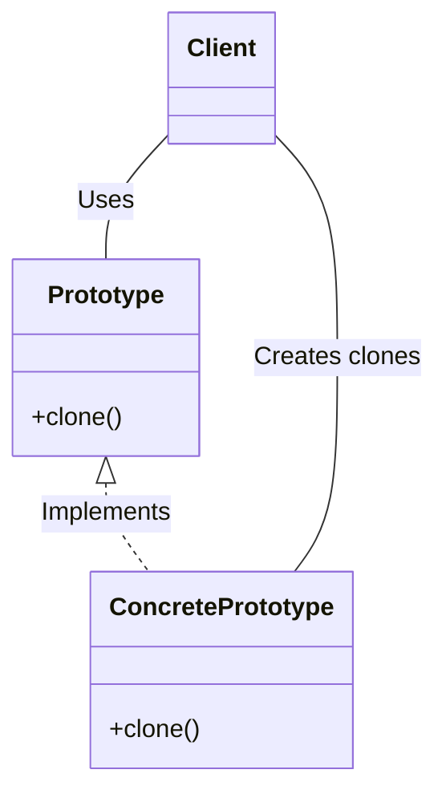

# Prototype

## Examples

- **[Car Builder](https://github.com/khalid-el-masnaoui/OOP-Principles-and-Design-Patterns-Notes/blob/main/design-patterns/Creational/Builder/CarBuilder.php)**
- **[Page Builder](https://github.com/khalid-el-masnaoui/OOP-Principles-and-Design-Patterns-Notes/blob/main/design-patterns/Creational/Builder/PageBuilder.php)**
- **[Car Builder - 2](https://github.com/khalid-el-masnaoui/OOP-Principles-and-Design-Patterns-Notes/blob/main/design-patterns/Creational/Builder/CarBuilder-2.php)**
- **[Vehicle Builder](https://github.com/khalid-el-masnaoui/OOP-Principles-and-Design-Patterns-Notes/blob/main/design-patterns/Creational/Builder/VehicleBuilder.php)**

## Definition 

**Prototype** is a creational design pattern that lets you copy existing objects without making your code dependent on their classes.

- Prototype allows us to hide the complexity of making new instances from the client.
- The concept is to copy an existing object rather than creating a new instance from scratch, something that may include costly operations.
- To avoid the cost of creating objects the standard way (new Foo()) and instead create a prototype and clone it.

## Diagram 

