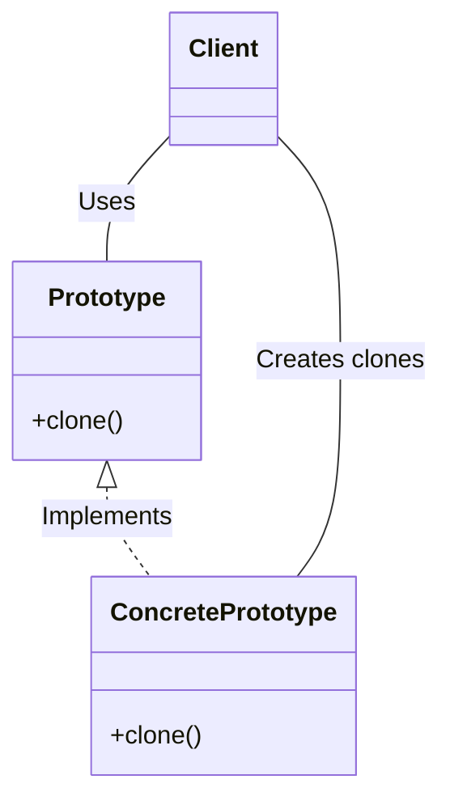

# Prototype

## Examples

- **[Page Prototype]()**
- **[Book Prototype]()**
- **[Plane Prototype]()**

## Definition 

**Prototype** is a creational design pattern that lets you copy existing objects without making your code dependent on their classes.

- Prototype allows us to hide the complexity of making new instances from the client.
- The concept is to copy an existing object rather than creating a new instance from scratch, something that may include costly operations.
- To avoid the cost of creating objects the standard way (new Foo()) and instead create a prototype and clone it.

## Diagram 

## When to Use

Use the Prototype design pattern when creating objects is expensive or time-consuming, when you need multiple variations of an object without using subclasses, or when the concrete classes are unknown at compile time. This pattern is useful for applications that need to clone pre-configured objects, such as a user with a specific set of settings or a document with a particular layout. 

When to use the Prototype pattern

- **Object creation is resource-intensive:**  If instantiating an object requires significant resources or time, such as connecting to a database, making network calls, or performing complex calculations, it is more efficient to clone an existing prototype. 
    
- **Creating multiple object configurations:**  When you need to create numerous objects that share similar configurations but have minor differences, the Prototype pattern allows you to start with one prototype and clone and modify it as needed, rather than writing multiple constructors or classes. 
    
- **Avoiding subclassing:**  Instead of creating a large number of subclasses that only differ in their initial state, you can use the Prototype pattern to create new objects by copying existing ones. 
    
- **When concrete classes are unknown:**  The pattern is useful when your code depends on a general cloning interface, not on the specific, concrete classes of the objects it is cloning. This often occurs when working with objects from third-party libraries where you don't have control over their source code. 
    
- **To reduce the number of classes:**  The pattern helps to reduce the class hierarchy, as new object types can be created by copying and modifying existing ones at runtime, rather than by defining new classes at compile time
