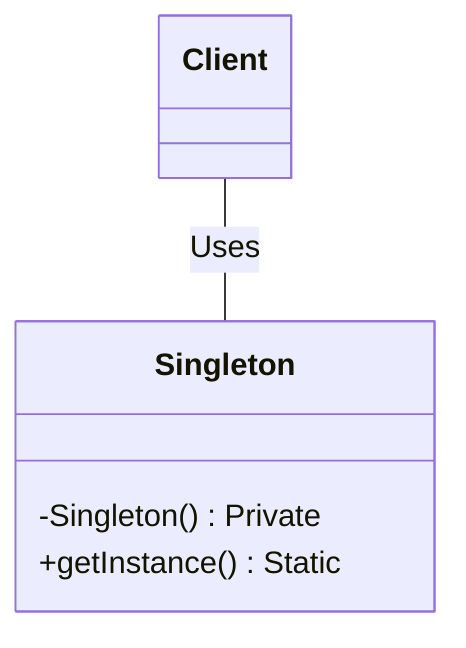

# Singleton

## Examples

- **[Application Singleton](https://github.com/khalid-el-masnaoui/OOP-Principles-and-Design-Patterns-Notes/blob/main/design-patterns/Creational/Singleton/ApplicationSingleton.php)**
- **[Database Singleton](https://github.com/khalid-el-masnaoui/OOP-Principles-and-Design-Patterns-Notes/blob/main/design-patterns/Creational/Singleton/DatabaseSingleton.php)**
- **[Logger Singleton](https://github.com/khalid-el-masnaoui/OOP-Principles-and-Design-Patterns-Notes/blob/main/design-patterns/Creational/Singleton/LoggerSingleton.php)**
- **[Configuration Manager Singleton](https://github.com/khalid-el-masnaoui/OOP-Principles-and-Design-Patterns-Notes/blob/main/design-patterns/Creational/Singleton/ConfigManagerSingleton.php)**

## Definition 

**Singleton** is a creational design pattern that lets you ensure that a class has only one instance, while providing a global access point to this instance.

- **Single Instance:**  The pattern guarantees that only one instance of the class can be created throughout the application's lifecycle.
- **Global Access:**  It provides a well-defined, global point of access to that single instance, allowing other parts of the application to interact with it.

Implementation details typically involve:

- **Private Constructor:**  The class's constructor is made private to prevent direct instantiation using the `new` operator from outside the class.
    
- **Static Instance Variable:**  A static member variable within the class holds the single instance of the class.
    
- **Static Factory Method:**  A static method (often named `getInstance()`) is provided to return the single instance. This method checks if an instance already exists; if not, it creates one and stores it in the static variable, otherwise, it returns the existing instance.

## Diagram 

## When to Use

The Singleton design pattern is used when a class must have only one instance, and that instance needs to be globally accessible throughout the application. It ensures a single point of control and access for a specific resource or service.

Here are some common scenarios where the Singleton pattern is applicable:

- **Managing Shared Resources:**  When there's a need to control access to a single, shared resource like a database connection pool, a thread pool, a configuration manager, or a cache. The Singleton ensures that all parts of the application use the same instance of the resource, preventing conflicts and optimizing resource usage.
    
- **Coordinating System-Wide Actions:**  For components that need to coordinate actions across the entire system, such as a logging service, a print spooler, or a file manager. A single instance ensures consistent behavior and centralized control over these operations.
    
- **Managing Application State:**  In situations where a single instance needs to manage the state of the application, like a user session manager or an application-wide settings object. This provides a consistent view of the state to all components.
    
- **Avoiding Global Variables with Controlled Access:**  While similar to global variables in providing global access, the Singleton pattern offers more control by encapsulating the instance creation and access logic within the class itself. This allows for lazy initialization and stricter management of the instance's lifecycle compared to simple global variables.
    
- **When a "Many-to-One" Relationship Exists:**  If many different parts of your system need to interact with a single instance of a particular service or object, a Singleton can provide that single, consistent access point.
    

Common use cases for the Singleton pattern include:

- **Logging:** A single logger instance to handle all logging operations in an application.
- **Configuration Manager:** A single configuration object to manage application settings.
- **Database Connection Pool:** A single instance to manage and provide database connections.
- **Caching:** A single cache manager to store and retrieve frequently accessed data.

Considerations and potential drawbacks:

- **Global State:**  Singletons introduce global state, which can make testing and debugging more challenging.
    
- **Tight Coupling:**  They can lead to tight coupling between components that rely on the singleton.
    
- **Thread Safety:**  In multi-threaded environments, care must be taken to ensure thread-safe instantiation of the singleton.
    
- **Testability:**  Mocking or replacing singletons during unit testing can be difficult.
    

Despite its utility in certain scenarios, the Singleton pattern is sometimes considered an **anti-pattern** due to its potential drawbacks, and alternative patterns like **Dependency Injection** are often preferred for managing dependencies and promoting loose coupling.