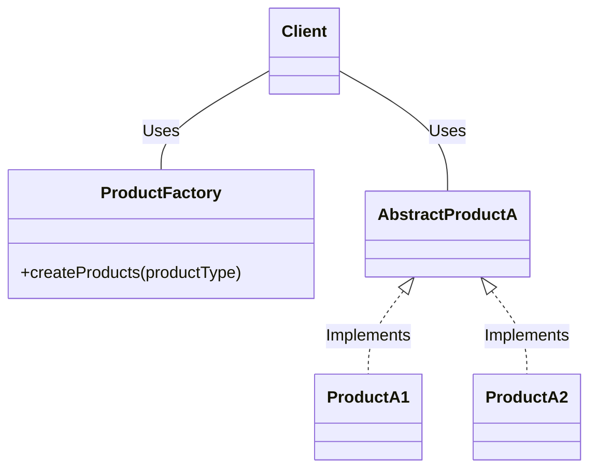

# Static Factory

## Examples

- **[Product Factory](https://github.com/khalid-el-masnaoui/OOP-Principles-and-Design-Patterns-Notes/blob/main/design-patterns/Creational/StaticFactory/ProductFactory.php)**
- **[Formatter Factory](https://github.com/khalid-el-masnaoui/OOP-Principles-and-Design-Patterns-Notes/blob/main/design-patterns/Creational/StaticFactory/FormatterFactory.php)**
- **[Vehicle Factory](https://github.com/khalid-el-masnaoui/OOP-Principles-and-Design-Patterns-Notes/blob/main/design-patterns/Creational/StaticFactory/VehicleFactory.php)**

## Definition 

Similar to the Abstract Factory, this pattern is used to create series of related or dependent objects. The difference between this and the abstract factory pattern is that the static factory pattern uses just one static method to create all types of objects it can create. It is usually named `factory` or `build`.

## Diagram 

## When to Use

Static factory, a variation of the Abstract Factory design pattern, are utilized in Object-Oriented Programming (OOP) for object creation when specific conditions or requirements are present.

When to use static factory methods:

- **When you want to return cached or existing instances:** Unlike constructors, static factory are not obligated to create a new object every time they are called. They can return pre-existing instances from a cache, which can be beneficial for resource management and performance, especially with immutable objects or singletons.

- **When you need more descriptive names for object creation:** Constructors always share the same name as the class. Static factory methods can have meaningful names that clearly indicate the purpose of the object being created, improving code readability and self-documentation.

- **When the exact type of object to be created is determined at runtime:**  Static factory methods can encapsulate the logic for deciding which concrete class to instantiate based on certain conditions or input parameters, abstracting this decision from the client code. 
    
- **When you want to return an object of a subtype:**  Static factory methods can return an object of a subtype of the class in which they are defined, providing flexibility in object creation and allowing for more polymorphic behavior.
    
- **When you want to control object creation, such as for singletons or limited resources:** Static factories can manage the creation and lifecycle of objects, ensuring that only a single instance exists (singleton pattern) or controlling the number of instances for limited resources.