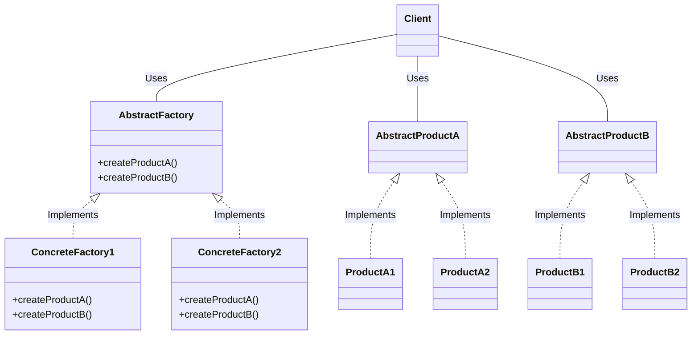

# AbstractFactory

## Definition 

Abstract Factory is used create series of related or dependent objects without specifying their concrete classes. Usually the created classes all implement the same interface. The client of the abstract factory does not care about how these objects are created, it just knows how they go together.

## Diagram 

